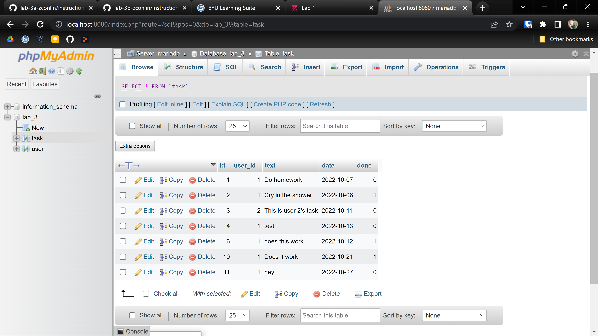
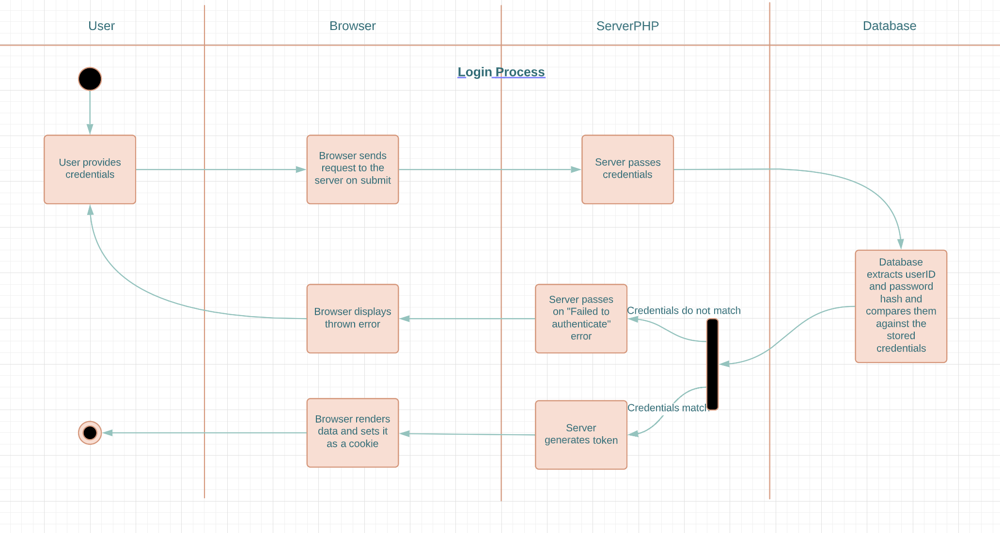
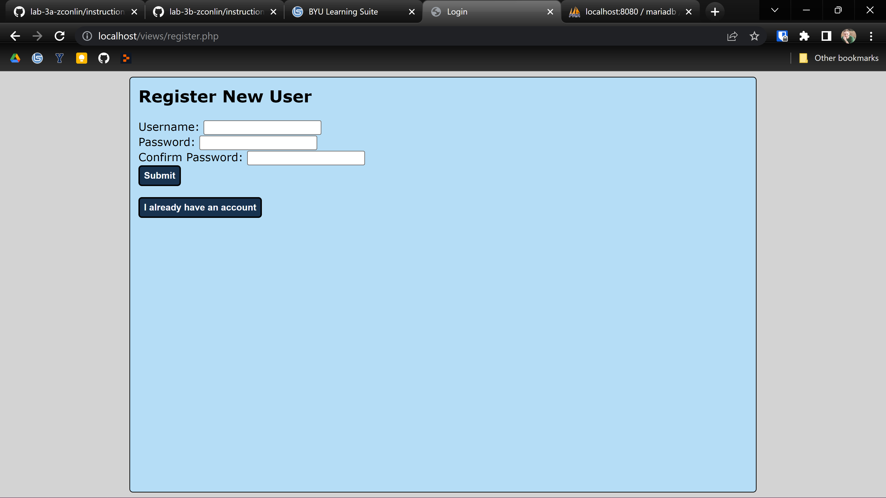
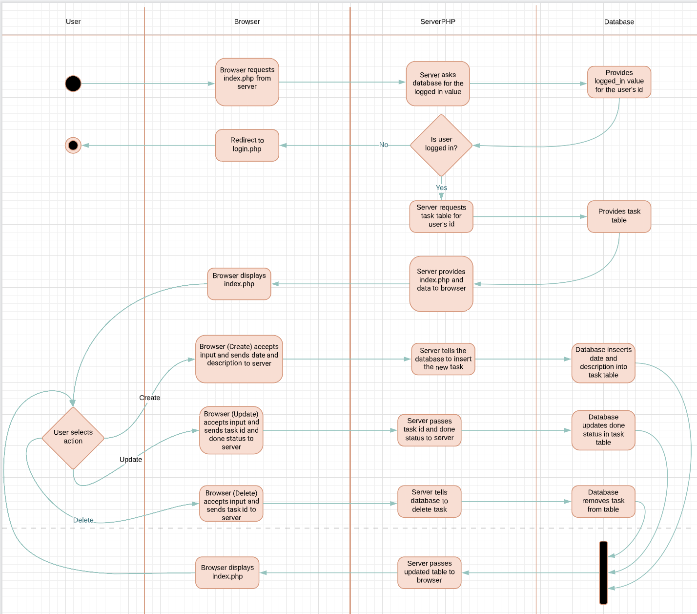
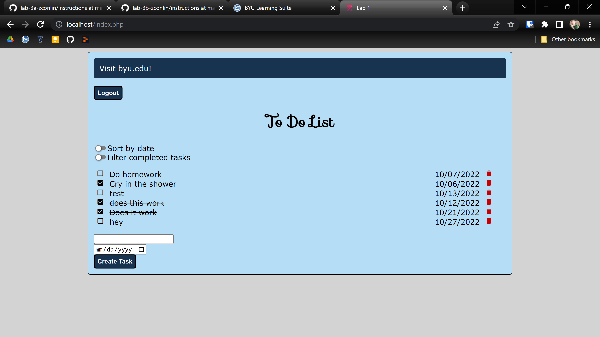

# Zac Conlin - 12 October - Lab 3

## II. Executive Summary (3 pts):

In this lab, I took the functionality that I created in Lab 2 in JavaScript and transpiled it into PHP on a database. I learned how to navigate and use phpmyadmin to create a database of users and tasks. I also made use of the LAMP stack and session variables in order to make my webpage work.

## III. Design Overview (5 pts):

This lab continued building on the rest of the labs from this class, and we implemented some similar functionality as lab 2, but instead of doing so in JavaScript we rewrote it in PHP. This transpilation presented an interesting challenge because I already knew the logic, but had never coded in PHP before. 

Additionally, for the JavaScript, I had made use of local storage in order to make data persistent, but in this lab I added database functionality. This was the first thing I did, setting up my database through phpmyadmin. Pictured below is an example of one of the tables I had created, which stores the task data:

Fig 1: PHP Task Table

Once I had the database set up with users, I had to create new pages under my domain for login and registration. I then had to use PHP to allow the user to create an account, and generate the SQL necessary to insert their information (Username, ID, a hashed password, and a password check) into my database. The logic for the login and registration processes are present in the following two diagrams:

Fig 2: The logic for the crud functions.

Fig 3: The logic for the crud functions.

These pages are functional and can create new users, log them in, and redirect to the main index.php file. The register page looks like this:

Fig 4: The Registration Page

I then implemented the Create, Read, Update, and Destroy functions into my PHP page. These work the same as in lab 2, but utilize session variables and prepared SQL statements to modify the database. These session variables take input from the user or data from the database and make it available for the website to use.

Fig 5: The logic for the crud functions.

I also spent a fair amount of time making sure the various elements looked clean and that the page is visually pleasing. I made buttons to navigate between the login and register page, and also implemented a functionality in the index.php file that will redirect a logged out user to the login page. Below is a screenshot of the final product of the lab:

Fig 6: The final result for the todo list

## IV. Questions (4 pts):

### Lab 3a Questions

*Describe how cookies are used to keep track of the state. (Where are they stored? How does the server distinguish one user from another? What sets the cookie?)*

Cookies are files in the client's browser that can store data that a webpage can then access each time it gets loaded so it can personalize the experience for the user. They are set by the browser and stored in the browser, assigned to the user's id or account in order to save the settings for the specific user.

### Lab 3b Questions

*Describe how prepared statements help protect against SQL injection, but not XSS.*

Prepared statements help the server know what to expect when making requests to the database so if it is not what it expects it can throw an error. This does not stop XSS though, as XSS can still access the server files, while those prepared statements just protect the database.

*Describe at least two key differences between the PHP version of the task list and the JavaScript one you completed in labs 2A and 2B.*

In order to save any data, JavaScript made use of local storage, while the php version stored everything in the database. Additionally, JavaScript executed within the browser on the client side, while php executed in the server.

*If we created a new table login_logout in the database to keep track of login and logout times of our various users, what would that table's schema look like? Describe necessary fields, which fields would need to be primary or unique, and what data type you would use for each.*

We would need a primary unique user id (int), an auto incrementing log id (int), a login time (string), and a logout time (string). The login and logout would be accessed via a SQL command that would provide the user id and action, then create a new log id to store the login or logout time.

## V. Lessons Learned (4 pts):
*Problem 1*

While attempting to redirect a user to a different page, an error may show up saying: 
Warning: Cannot modify header information - headers already sent by (output started at /var/www/html/index.php:5) in /var/www/html/index.php on line 9. This is possibly due to echoing something before the PHP header function such as debugging with 'echo var_dump', so removing that line could fix the problem.

*Problem 2*

Task check off
While transpiling the update task functionality, trying to include the JavaScript ternary operation can be tempting. This has proven to be difficult, and can be solved by simply writing two IF statements into the PHP.

*Problem 3*

When logging in, once the password hash has been implemented, any users manually created in phpmyadmin or added before the hash will be unaccessible. This is because the hashed password is now being compared to the old plaintext password, and since they do not exactly match, it will return false.

## VI. Conclusions (4 pts):

### Skills Acquired
- Code in php
- Create and update tables in phpmyadmin
- Authenticate a user by their id
- Use prepared statements to generate SQL

### References
Guide to CRUD functions in PHP: https://www.simplilearn.com/tutorials/php-tutorial/php-crud-operations

Helped me with almost all of my syntax questions and issues: https://www.w3schools.com 

Helped me learn how to use phpmyadmin: https://www.elegantthemes.com/blog/resources/a-quick-guide-to-phpmyadmin-and-how-you-can-use-it 